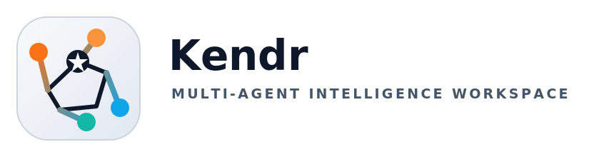

<p align="center">
  <picture>
    <source media="(prefers-color-scheme: dark)" srcset="docs/assets/kendr-logo-dark.svg">
    
  </picture>
</p>

# Kendr

> Multi-agent intelligence workspace for evidence-driven research, document ingestion, and persistent knowledge workflows.

Kendr is a setup-aware orchestration runtime that combines specialized agents, web and local evidence, durable memory, and structured run artifacts to produce research briefs, knowledge sessions, and report-ready analysis. The strongest product surface today is not "AI for everything"; it is intelligence work that needs traceability, synthesis, and reusable context.

[Docs](docs/index.md) · [Quickstart](docs/quickstart.md) · [Install](docs/install.md) · [Architecture](docs/architecture.md) · [Agents](docs/agents.md) · [Integrations](docs/integrations.md) · [Security](docs/security.md) · [Examples](docs/examples.md)

## What Kendr Is

Kendr is a terminal-first, Python-native multi-agent runtime for high-context work that benefits from setup-aware routing, persistent artifacts, and reusable knowledge sessions.

It is strongest when the job requires:

- web and document evidence gathering
- synthesis that stays tied to sources and artifacts
- workflow orchestration across specialized agents
- explicit setup and verification instead of hidden magic

## What It Does Well

The recommended entry points today are:

- deep research
- local-drive intelligence
- `superRAG`
- coding project delivery
- local command execution

## Quickstart

1. Install the repo locally.

```bash
./scripts/install.sh
```

2. Configure environment and choose a working directory.

```bash
kendr setup set core_runtime KENDR_WORKING_DIR /absolute/path/to/workdir
kendr setup set openai OPENAI_API_KEY sk-...
kendr setup status
python scripts/verify.py smoke
```

3. Run your first intelligence brief.

```bash
kendr run --current-folder \
  "Create an intelligence brief on Stripe: business model, products, competitors, recent strategy moves, and top risks."
```

The runtime may stop first on an approval-ready plan before executing the workflow. See [Quickstart](docs/quickstart.md) for the full walkthrough.

## Install And Verify

Linux or macOS:

```bash
./scripts/install.sh
python scripts/verify.py
```

Windows PowerShell:

```powershell
powershell -ExecutionPolicy Bypass -File .\scripts\install.ps1
python .\scripts\verify.py
```

The default verifier runs `compile`, `unit`, `smoke`, and `docs`. See [Verification](docs/verification.md) for the exact buckets and current coverage.

## Primary Workflows

- deep research for source-aware, web-grounded analysis
- local-drive intelligence across mixed file types with OCR and per-document summaries
- persistent `superRAG` sessions over files, URLs, databases, and OneDrive
- coding project delivery through blueprint, planning, and delegated implementation
- local command execution with explicit approval and privileged audit trails

## Feature Status Matrix

| Status | Areas | What It Means Today |
| --- | --- | --- |
| Stable | core CLI and runtime, setup-aware discovery and routing, local-drive intelligence, report synthesis, `superRAG` knowledge sessions | strongest current product path and best place for new users to start |
| Beta | OpenAI deep research, long-document workflow, gateway HTTP surface, communication, monitoring, AWS, travel, authorized defensive security workflows, research proposal and patent workflows, deal-advisory workflows | implemented and usable, but more dependent on setup, tooling, or operational validation |
| Experimental | dynamic agent factory flow, generated agents, voice/audio workflows, future social ecosystem analysis | present or scaffolded, but not part of the primary product promise |

## Docs Map

- [Docs Index](docs/index.md)
  Main navigation page for the documentation set.
- [Product Overview](docs/product_overview.md)
  Current product thesis, scope boundaries, and workflow priorities.
- [Quickstart](docs/quickstart.md)
  First install, setup, and first run.
- [Install](docs/install.md)
  Local installation, environment configuration, Docker, and verification.
- [Verification](docs/verification.md)
  Bootstrap path plus unit, smoke, docs, and Docker verification buckets.
- [Core Workflows](docs/core_workflows.md)
  Recommended workflow demos, artifacts, and acceptance checks.
- [Architecture](docs/architecture.md)
  Runtime flow, discovery, setup-aware routing, persistence, and services.
- [Agents](docs/agents.md)
  Workflow families, status labels, and the full built-in inventory.
- [Integrations](docs/integrations.md)
  Providers, channels, OAuth-backed setup, plugin discovery, and MCP services.
- [Plugin SDK](docs/plugin_sdk.md)
  Versioned plugin contract, manifest expectations, and external contributor guidance.
- [Integration Checklist](docs/integration_checklist.md)
  Contract for adding integrations without drifting setup, detection, routing, docs, and tests.
- [Security](docs/security.md)
  Safety boundaries, authorized security workflow, and privileged controls.
- [Troubleshooting](docs/troubleshooting.md)
  First-run issues, setup gating, optional tools, and verification caveats.
- [Examples](docs/examples.md)
  Stable, beta, and experimental CLI examples.

## Contribute Safely

Use these repo-level guides:

- [CONTRIBUTING.md](CONTRIBUTING.md)
- [CHANGELOG.md](CHANGELOG.md)
- [RELEASING.md](RELEASING.md)
- [SECURITY.md](SECURITY.md)

Contribution baseline:

- keep changes grounded in real code and verified workflows
- preserve setup-aware gating and runtime behavior unless fixing a bug
- update tests and docs with user-facing changes
- run `python scripts/verify.py` before opening a PR

## Supporting References

- [Core Intelligence Stack](docs/super_agent_stack.md)
- [superRAG](docs/superrag_feature.md)
- [Local Drive Case Study](docs/local_drive_case_study.md)
- [Extended CLI Examples](SampleTasks.md)

## What Exists Today Under The Hood

The current codebase already includes:

- dynamic registry and discovery in [`kendr/discovery.py`](kendr/discovery.py)
- orchestration runtime in [`kendr/runtime.py`](kendr/runtime.py)
- shared runtime-state typing in [`kendr/orchestration/state.py`](kendr/orchestration/state.py)
- CLI entrypoint in [`kendr/cli.py`](kendr/cli.py)
- optional HTTP gateway and dashboard in [`kendr/gateway_server.py`](kendr/gateway_server.py)
- HTTP session/resume helpers in [`kendr/http/`](kendr/http)
- setup and provider boundaries in [`kendr/setup/`](kendr/setup) and [`kendr/providers/`](kendr/providers)
- domain-specific workflow slices in [`kendr/domain/`](kendr/domain)
- internal A2A-inspired task and artifact protocol in [`tasks/a2a_protocol.py`](tasks/a2a_protocol.py)
- durable SQLite persistence in [`kendr/persistence/`](kendr/persistence) with a compatibility shim at [`tasks/sqlite_store.py`](tasks/sqlite_store.py)
- shared research infrastructure in [`tasks/research_infra.py`](tasks/research_infra.py)
- Docker and MCP deployment assets in [`docker-compose.yml`](docker-compose.yml) and [`mcp_servers/`](mcp_servers)

## Known Gaps

What exists now is a strong base, not a finished intelligence platform.

Current gaps documented in the repo:

- no dedicated social connector agents yet
- no external graph database yet
- no sanctions or corporate registry APIs yet
- no full `docker compose up` runtime validation has been performed in this repo

## Verification Status

The repo documents these as verified today:

- Python import safety and CLI module entrypoint
- compileability
- registry discovery and setup-aware routing
- gateway HTTP smoke surface
- basic `superRAG` build flow with stubbed indexing
- docs-link integrity
- Docker Compose config validity and Docker image build

Not fully verified:

- live end-to-end external API workflows
- full Docker runtime execution
- MCP client interoperability
- heavy-load vector indexing behavior

## Public Repo Status

What this repo now includes:

- a structured docs landing page
- a single install and verification path aligned with CI
- plugin SDK guidance for external contributors
- changelog, release checklist, and contribution guidance
- GitHub issue and PR templates for clearer reporting

Still recommended for future public polish:

- real screenshots or short terminal demos captured from verified runs
- a repository license, if maintainers decide one
- a dedicated private security reporting channel documented in the repo

## Engineering Playbooks

These docs define how the project should be improved and how future LLM-driven features must be added.

- [Project Upgrade Plan](docs/project_upgrade_plan.md)
- [LLM Feature Delivery Guide](docs/llm_feature_delivery_guide.md)
